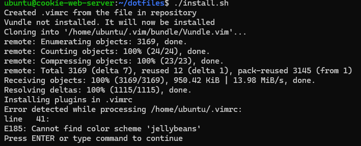

# Script Testing

In order to test my script, I had to go to a system that did not have the `.vimrc` file set up. I chose to do it in my AWS instance. I cloned this repository into my AWS instance, changed directories into it, and then executed the installation script. You can see a picture below of the output after running the script.

First, the script creates `.vimrc` from the one in this repository and tell the user that it has been completed. Then, it tells the user that `Vundle` is not installed. Below that, you can see the cloning process for installing `Vundle`. After, it tells the user that it will install the plugins for `.vimrc`. The error comes up, but after you press ENTER, the installation process for the plugins begins.
